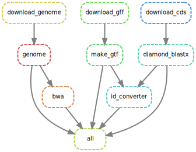

Build indexes.

Note: After downloaded gff, a manual correction in line 1064446 needs to be done.
A `\t` before `LOC_Os05g34730.1` needs to be changed to space.

```bash
snakemake --cores 20
```

View pipeline.

```bash
snakemake all --dag | dot -Tsvg > dag.svg
```


